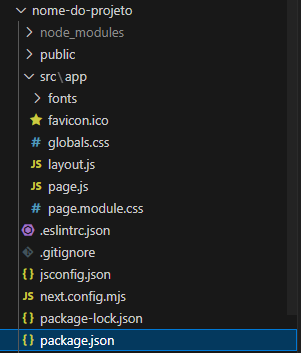

  # POC-05-React


Projeto que mostra como criar um projeto Next.js e utilizar o React.

## Criação do Projeto

Para a criação do projeto next.js é necessario seguir uma sequencia de ações.

1.Instalar o node.js.

2.Após a instalação, ir no terminal do VS code e digitar "npx create-next-app@latest nome-do-projeto".

3.Apareceram algumas opções, configure da forma que quiser. Esta eu acho a melhor forma de configuração.


4.Para entrar no diretório digite " cd nome-do-projeto"

5.E para iniciar o servidor digite " npm run dev "

## ReactJS 
Ele é uma biblioteca de JavaScript, criada pela Facebook, de código aberto para criar interfaces de usuário (UI) em aplicativos web ou a vídeos de reações em redes sociais.
Quando criar o projeto esse sera os arquivos que seram criados.



## Package.json 

O arquivo package.json é essencial em projetos Node.js e JavaScript, pois contém metadados sobre o projeto, como o nome, versão e descrição. Ele também lista as dependências necessárias para o funcionamento da aplicação, além de scripts que automatizam tarefas (como iniciar o servidor ou rodar testes). Este arquivo facilita a gestão e compartilhamento do projeto, garantindo que outras pessoas possam instalar as mesmas dependências e rodar o código corretamente.


## src/APP
No React, o arquivo src/App contém o primeiro componente do aplicativo, o App, e outras linhas de código.Cada arquivo ou subpasta dentro de app é mapeado automaticamente para uma rota correspondente na aplicação, simplificando a estrutura e o roteamento.Se houver um arquivo src/app/nome/page.js, a URL correspondente será http://localhost:3000/home que é onde seu app , pagina ou projeto vai estar rodando.
No projeto de exemplo está:

### Pasta Sherk
Ele é um arquivo para criar uma função shrek , é outra pagina dentro da pasta src/app/shrek , onde exibe o título sherk e uma imgem .

```function Shrek() {
    return (
        <div>
            <h1>Shrek</h1>
            
        </div>
    )
}

export default Shrek;//Exporta este componente para que possa ser utilizado em outros arquivos.
```
### Pasta fonts
Possui os arquivos GeistVF.woff e GeistMonoVF.woff são fontes que estão sendo carregadas localmente no projeto, o que significa que, ao invés de depender de fontes hospedadas em terceiros (como Google Fonts), os arquivos de fontes estão dentro da sua pasta do projeto e são aplicados diretamente ao design da página web.São arquivos de fontes em formato WOFF,ou seja , usados para fornecer tipos de letras personalizadas para o seu site.

### Favicon.ico
É nada mais que um ícone que aparece nas abas do navegador, marcadores e favoritos, ajudando na identificação visual do site e reforçando a marca.

### Globo.css

### Layout.js
Nesse ja terá codigos escritos que define um layout global com fontes personalizadas e configurações de meadados para a aplicação Next.js, utilizando o sistema de fontes locais e injeção de componentes filhos.t

### page.js
é um arquivo específico dentro de uma subpasta do app que define o conteúdo de uma rota. No Next.js, cada page.js dentro de uma pasta é responsável por renderizar a interface da rota correspondente. Nele onde vai colocar os codigos principais ou o codigo todo , como um main .
No codigo exemplo ele constrói uma página Home usando componentes e estilos específicos.
```
import Card from "../components/card/Card"; 
import styles from "./page.module.css";
import Menu from "../components/menu/Menu";

export default function Home() {
  return (
    <main>
      <Menu/>
      <h1 className={styles.titulo}>Qual filme é melhor?</h1>
      <section className={styles.filmes}>
        <Card url="https://br.web.img2.acsta.net/medias/nmedia/18/91/54/04/20150812.jpg"/>
        <Card url="https://play-lh.googleusercontent.com/QrSBQU8p6TijnsH2EfDpBfneddIP6JVYR4bSKyacA-cyIiYZQqdiryOTMkwqxxnfvfaL9UOhIo8-3XI2MWvQ"/>
      </section>
    </main>
  );
}
```
Os import são usados para trazer módulos, componentes, estilos ou outras dependências de arquivos externos para o arquivo atual. 

No "import Card from "../components/card/Card";" O componente Card está sendo importado de um arquivo chamado Card.js localizado dentro da pasta ../components/card/.Isso significa que, no arquivo Card.js, existe um componente que é exportado (usando export default ou export), e ele pode ser reutilizado no código.Nesse código o Card é utilizado para renderizar duas imagens de filmes, cada uma com um URL de imagem específico passado como uma propriedade (prop).Já o import Menu from "../components/menu/Menu"; tambem é um componentes reutilizável.
Mas no import styles from "./page.module.css";importa um arquivo CSS modular para aplicar estilos locais ao componente home.

Nessa parte:
```
export default function Home() {
  return (
    <main> //Envolve todo o conteúdo principal da página.
      <Menu/> // um menu de navegação.
      <h1 className={styles.titulo}>Qual filme é melhor?</h1>
      <section className={styles.filmes}> //"styles.filmes}" CSS importado 
        <Card url="https://br.web.img2.acsta.net/medias/nmedia/18/91/54/04/20150812.jpg"/>
        <Card url="https://play-lh.googleusercontent.com/QrSBQU8p6TijnsH2EfDpBfneddIP6JVYR4bSKyacA-cyIiYZQqdiryOTMkwqxxnfvfaL9UOhIo8-3XI2MWvQ"/>
      </section>
    </main>
  );
```
Será uma função para criar a pagina principal , onde foi criado dois card (dentro do section ).

### Page.module.css

## Pasta components
