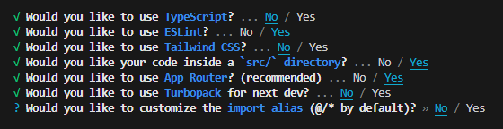

# POC-05-React

Projeto que mostra como criar um projeto Next.js e utilizar o React.

## Criação do Projeto

Para a criação do projeto next.js é necessario seguir uma sequencia de ações.

1.Instalar o node.js.

2.Após a instalação, ir no terminal do VS code e digitar "npx create-next-app@latest nome-do-projeto".

3.Apareceram algumas opções, configure da forma que quiser. Esta eu acho a melhor forma de configuração.

4.Para entrar no diretório digite " cd nome-do-projeto"

5.E para iniciar o servidor digite " npm run dev "

## ReactJS 
Ele é uma biblioteca de JavaScript, criada pela Facebook, de código aberto para criar interfaces de usuário (UI) em aplicativos web ou a vídeos de reações em redes sociais

## src/APP
No React, o arquivo src/App contém o primeiro componente do aplicativo, o App, e outras linhas de código.Cada arquivo ou subpasta dentro de app é mapeado automaticamente para uma rota correspondente na aplicação, simplificando a estrutura e o roteamento.Se houver um arquivo src/app/nome/page.js, a URL correspondente será http://localhost:3000/home que é onde seu app , pagina ou projeto vai estar rodando.

## Pasta page.js
é um arquivo específico dentro de uma subpasta do app que define o conteúdo de uma rota. No Next.js, cada page.js dentro de uma pasta é responsável por renderizar a interface da rota correspondente. Nele onde vai colocar os codigos principais ou o codigo todo , como um main .
